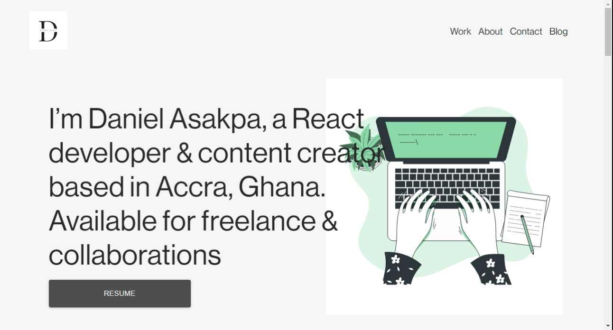

# Personal portfolio - v2.0


My personal website. A simple, easily modifiable, statically-exportable React, Jamstack application. Built using modern javascript, based on create-react-app with React-Router, react-scroll, aos and many other useful technologies.


## Demo

[View it live](https://danielasakpa.netlify.app/)

## Screenshots


<h3 align="center">
    🔹
    <a href="https://github.com/danielasakpa/Portfolio-2/issues">Report Bug</a> &nbsp; &nbsp;
    🔹
    <a href="https://github.com/danielasakpa/Portfolio-2/issues">Request Feature</a>
</h3>

## Tech Stack
My personal portfolio [danielasakpa.com](https://danielasakpa.netlify.app/) which features some of my github projects as well as my resume and technical skills.

This project was built using these technologies.


- React
- Material ui
- CSS3
- Email js
- Responsive design

## Features

**📖 Multi-Page Layout**

**🎨 Styled with Material ui and Css with easy to customize colors**

**📱 Fully Responsive**

## 🛠 Installation and Setup Instructions

Install my-project with npm

```bash
  #install app
  npm install

  #Runs the app in the development mode.
  npm start
```
Open http://localhost:3000 to view it in the browser.
    
## Environment Variables

To run this project, you will need to add the following environment variables to your .env file
Check out [Email js to get it](https://www.emailjs.com/)

`SERVICE_ID`

`PUBLIC_KEY`


## Contributing

Contributions are always welcome!

See `contributing.md` for ways to get started.

Please adhere to this project's `code of conduct`.


## Feedback

If you have any feedback, please reach out to us at danielasakpa@gmail.com


## Authors

- [@oba_code](https://twitter.com/oba_code)

